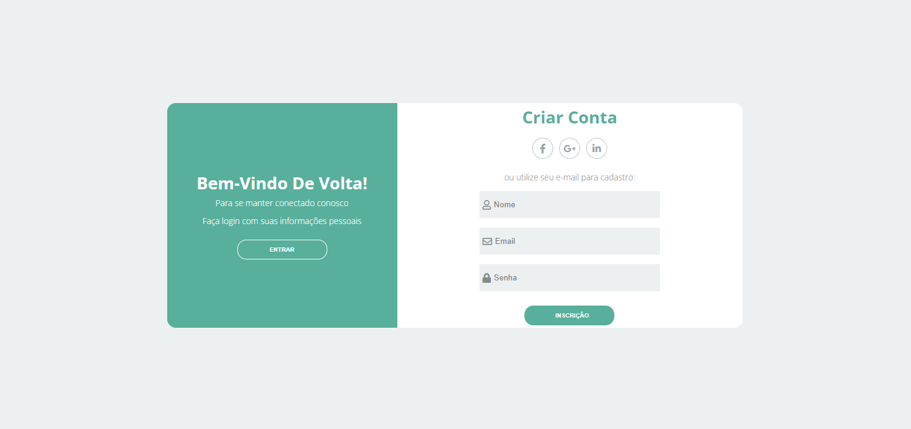

<h1 align="center"> Dynamic login screen </h1>

  <a href="#🚀-tecnologias">Tecnologias</a>&nbsp;&nbsp;&nbsp;|&nbsp;&nbsp;&nbsp;
  <a href="#💻-projeto">Projeto</a>&nbsp;&nbsp;&nbsp;|&nbsp;&nbsp;&nbsp;
  <a href="#🔖-layout">Layout</a>&nbsp;&nbsp;&nbsp;|&nbsp;&nbsp;&nbsp;
  <a href="#memo-licença">Licença</a>

  

 

  

## 🚀 Tecnologias

Esse projeto foi desenvolvido com as seguintes tecnologias:

- HTML e CSS
- JavaScript
- Git e Github
- Figma

## 💻 Projeto

O Dynamic login screen é uma tela de login básica desenvolvida com as tecnologias web fundamentais: HTML, CSS e JavaScript. Esta tela de login é uma solução leve e fácil de integrar para autenticar usuários em suas aplicações web. Ela oferece uma interface simples e amigável para que os usuários acessem seus sistemas com facilidade.

## 🔖 Layout

Você pode visualizar o layout do projeto através [DESSE LINK](https://figma.com). É necessário ter conta no [Figma](https://figma.com) para acessá-lo.

## :memo: Licença

Esse projeto está sob a licença MIT.

---
